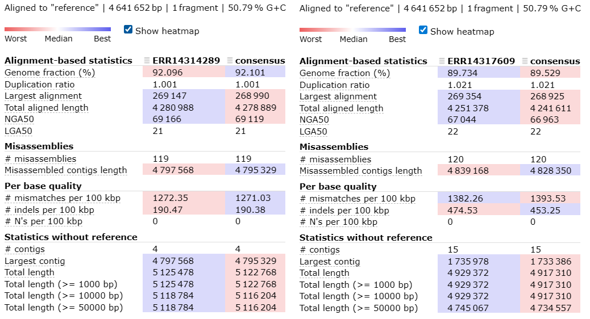

## CALIDAD - NANOPLOT

  ### ERR14314289

  ### ERR14317609

## CALIDAD LUEGO DEL TRIMADO - NANOPLOT

## CALIDAD DEL ENSAMBLADO - QUAST

## ANOTACION DE LOS GENOMAS - BAKTA

### Visualización del genoma de la cepa ERR14314289

### Visualización del genoma de la cepa ERR14317609

## ANALISIS FILOGENETICO - IQTREE

