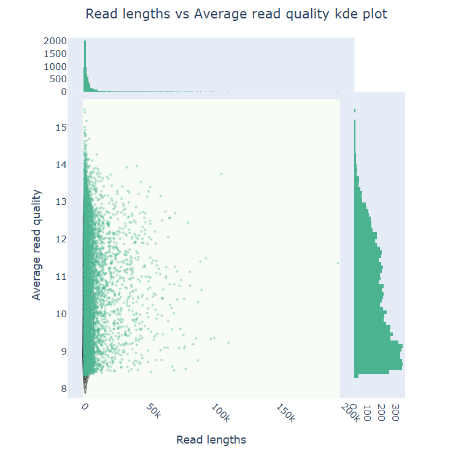
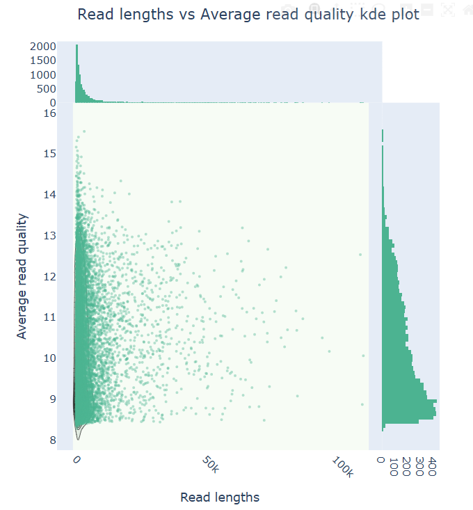
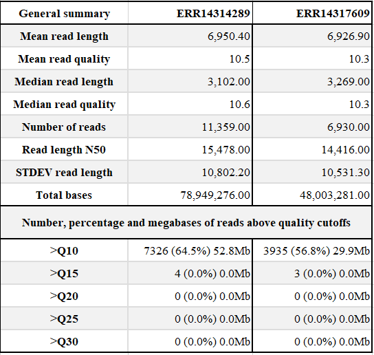

## RESULTADO DE CALIDAD - NANOPLOT

  ### ERR14314289

  ### ERR14317609

## RESULTADO DE CALIDAD LUEGO DEL TRIMADO - NANOPLOT

## RESULTADO DE LA ANOTACION - BAKTA

### Visualización del genoma de la cepa ERR14314289

### Visualización del genoma de la cepa ERR14317609

